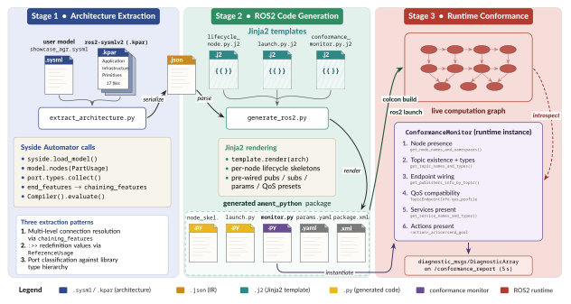

# Architecture as Code

> A SysML v2 Domain Library for ROS2 Robotics Systems

`ros2-sysmlv2` is the first shareable SysML v2 domain library that captures the full ROS2 architectural vocabulary using SysML v2's native constructs: no profiles, no stereotypes, no metamodel extensions. A companion bridge pipeline projects the ROS2-relevant subset of a multi-domain architecture model into a buildable ROS2 package and an auto-generated runtime conformance monitor that continuously checks the live system against its specification.



## What this repository contains

| Path | Purpose |
| --- | --- |
| [`projects/ros2-sysmlv2/`](projects/ros2-sysmlv2/) | The SysML v2 domain library: 17 packages, 179 definitions, packaged as a Sysand `.kpar` archive |
| [`bridge/`](bridge/) | Python bridge pipeline (`extract_architecture.py`, `generate_ros2.py`, `run_demo.py`) using the Syside Automator SDK |
| [`bridge/templates/`](bridge/templates/) | Jinja2 templates for the generated ROS2 package (lifecycle node, launch, params, conformance monitor) |
| [`demos/`](demos/) | Demo architecture models: `agr/` (ab initio AGR, 11 nodes, all 8 archetypes), `agr-nav2/` (Nav2 hybrid, 17 nodes), `uav/` (reference models for trade studies and behavioral demos), `_shared/` (grid-view library) |
| [`ros2-py-outputs/`](ros2-py-outputs/) | Committed generated `ament_python` packages, one per demo — pull onto a ROS2 Jazzy box and `colcon build` directly |
| `ros2-cpp-outputs/` | Committed generated `ament_cmake` (C++) packages, one per demo (produced by the `--lang cpp` backend) |
| [`tests/`](tests/) | Library and pipeline test suite |
| [`tools/`](tools/) | Conformance checkers validating the library against ROS2 Jazzy source |
| [`studies/`](studies/) | Case studies and supporting analyses |

## Library architecture (three layers)

The library mirrors the ROS2 stack itself, with each layer depending only on those below it:

| Layer | ROS2 parallel | Packages |
| --- | --- | --- |
| **Application** | Nav2 framework | `archetypes`, `nav2` |
| **Infrastructure** | `rclpy`/`rclcpp`, DDS | `comm`, `lifecycle`, `deployment`, `params`, `tf2` |
| **Primitives** | `common_interfaces` | `foundation`, plus 10 ROS2 message packages |

Every definition is grounded against actual ROS2 Jazzy source code via automated conformance checking: message fields, QoS profiles, lifecycle states, Nav2 server class inheritance, all verified against the upstream C++/Python sources.

## Bridge pipeline (three stages)

The pipeline applies a **projection principle**: a multi-domain SysML v2 model may contain mechanical, electrical, and requirements layers, but only elements typed against the `ros2-sysmlv2` library are extracted. Non-ROS2 elements coexist transparently; the library's type hierarchy *is* the projection.

1. **Extract** ([`bridge/extract_architecture.py`](bridge/extract_architecture.py)): loads the `.sysml` model and library via `syside.load_model()`, walks the system part hierarchy, classifies ports and connections against the library type vocabulary, emits `architecture.json`.
2. **Generate** ([`bridge/generate_ros2.py`](bridge/generate_ros2.py)): renders Jinja2 templates to produce a complete `ament_python` package: lifecycle node skeletons with pre-wired publishers/subscribers/parameters, launch file, parameter YAML, and the auto-generated conformance monitor.
3. **Verify** (auto-generated `conformance_monitor.py`): runs as a ROS2 node alongside the deployed system, periodically introspects the live computation graph, and publishes a `DiagnosticArray` on `/conformance_report` reporting structural conformance against the model.

The generated package builds and runs on ROS2 Jazzy without modification; engineers fill in callback logic where the model deliberately stops at architectural boundaries.

## Reproduction guide

### Prerequisites

- **macOS or Ubuntu** (24.04 recommended for ROS2 Jazzy deployment)
- **Python 3.13** managed via [`uv`](https://github.com/astral-sh/uv)
- **ROS2 Jazzy** for the deployment phase (Ubuntu 24.04 only)
- **Syside Automator**: Sensmetry's Python SDK for SysML v2; freely available with an [academic license](https://sensmetry.com/syside)
- **Sysand**: the SysML v2 package manager (`uv tool install sysand`)

The Syside Automator is installed via the Syside VS Code extension's "Create Python virtual environment with Syside Automator" command, which produces a `.venv/` containing Syside, Sysand, and project dependencies.

### Setup

```bash
# Clone
git clone https://github.com/sdamera95/Architecture-as-Code.git
cd Architecture-as-Code

# Activate the .venv set up by the Syside extension
source .venv/bin/activate

# Verify Syside Automator is importable
python -c "import syside; print(syside.__version__)"
```

All `syside`, `sysand`, `python`, and project CLI tools must be invoked through the venv (either `uv run <cmd>` or `source .venv/bin/activate &&  <cmd>`). System-level Python or system-level `syside` will resolve to a different binary lacking the project dependencies.

### Run the bridge pipeline

The single-command driver wraps both pipeline stages:

```bash
# Ab initio autonomous ground robot (11 nodes, all 8 archetypes)
uv run python bridge/run_demo.py demos/agr/showcase_agr_full.sysml \
    --system AutonomousGroundRobot --wired

# Nav2 hybrid (5 custom + 12 Nav2 nodes)
uv run python bridge/run_demo.py demos/agr-nav2/showcase_agr_nav2_full.sysml \
    --system GroundRobotWithNav2 --wired

# Or regenerate the committed demo packages (ros2-py-outputs/, ros2-cpp-outputs/) in one shot
uv run python bridge/regen_demos.py
```

`run_demo.py` outputs land in `generated/` (gitignored scratch space); `regen_demos.py` writes the committed packages under `ros2-py-outputs/<demo>/` and `ros2-cpp-outputs/<demo>/`. Package layout:

```text
generated/<system_name>/
    package.xml
    setup.py / setup.cfg
    <system_name>/                       # Python package
        <node_name>.py                   # one lifecycle node skeleton per modeled node
        conformance_monitor.py           # auto-generated runtime checker
    launch/<system_name>_launch.py       # launch description with lifecycle manager
    config/params.yaml                   # parameter values from the model
```

The `--wired` flag seeds every publisher with a timer emitting default-constructed messages and every subscriber with a logging callback, making the complete topology exercisable in `rqt_graph` and Foxglove before any real callback logic is implemented.

### Build and deploy on ROS2 Jazzy

The committed demo packages make this a pull-and-build workflow — the complete
remote-box procedure (workspaces, Isaac Sim integration, conformance verification,
where hand-written logic goes) is in [demos/RUNBOOK.md](demos/RUNBOOK.md):

```bash
# In a Jazzy-sourced shell, on Ubuntu 24.04
git clone https://github.com/sdamera95/Architecture-as-Code.git
mkdir -p ~/ros2_ws/src && ln -s "$(pwd)/Architecture-as-Code/ros2-py-outputs" ~/ros2_ws/src/demos
cd ~/ros2_ws
colcon build
source install/setup.bash

# Launch the system
ros2 launch <system_name> <system_name>_launch.py

# Inspect the conformance report
ros2 topic echo /conformance_report
```

The conformance monitor publishes one `DiagnosticArray` every 5 seconds covering node coverage, topic existence and types, per-connection endpoint wiring, and QoS policy compatibility.

### Run the test suite

```bash
# Library + bridge pipeline tests
uv run pytest tests/ -v

# Conformance against ROS2 Jazzy source (validates message types, QoS profiles,
# lifecycle, TF2/params, and Nav2 archetypes against the upstream sources)
uv run python tools/run_all_conformance.py
```

## Validation summary

End-to-end validation across 753 automated checks:

| Component | Checks | Result |
| --- | ---: | --- |
| Message types (field-by-field vs. 87 modeled `.msg` types; unmodeled messages skipped by design) | 310 | pass |
| Communication (QoS enums, profiles, port/conn defs vs. `rclpy`) | 62 | pass |
| Lifecycle (states/transitions vs. `lifecycle_msgs`) | 20 | pass |
| TF2 and parameters (vs. `rcl_interfaces`) | 48 | pass |
| Nav2 nodes (class inheritance, endpoints vs. C++ source) | 43 | pass |
| Remaining message packages (vs. `common_interfaces`) | 23 | pass |
| Library subtotal | **506** | pass |
| Library test suite (10 categories, 179 definitions) | 133 | pass |
| End-user test (downstream model imports and specializes) | 15 | pass |
| Bridge pipeline (extraction, generation, monitor) | 66 | pass |
| ROS2 Jazzy deployment (showcase AGR: nodes, topics, connections, QoS) | 33 | pass |
| **Total** | **753** | pass |

Both showcase architectures deploy on ROS2 Jazzy with **zero conformance violations**:

- `showcase_agr_full.sysml`: 11/11 nodes, 11/11 topics, 11/11 connections matched
- `showcase_agr_nav2_full.sysml`: 17/17 nodes (5 custom and 12 Nav2), all topics and TF frames matched

## Project status

Pre-1.0 research code, actively developed. The bridge generates both **`ament_python` (rclpy)** and **`ament_cmake` (rclcpp_lifecycle)** packages from the same language-agnostic `architecture.json` IR (`--lang {py,cpp}`), using a generation-gap pattern: `*_node_base.*` wiring is regenerated on every run, while the derived `*_node.*` implementation files are generated once and never overwritten, so hand-written logic survives model-driven regeneration. The conformance monitor, launch file, and parameter YAML are language-neutral and byte-identical across both packages.

Current focus areas:

- **Behavioral conformance**: extending the runtime monitor from structural checks to lifecycle transition sequences and `require constraint` predicate evaluation
- **Analysis Model**: a differentiable analytical twin generated from the same `.sysml` source for gradient-based design-space exploration

## Related publication

A manuscript describing this work is in preparation for the *Wiley Systems Engineering Journal*. Citation details will be added here on acceptance.

## Acknowledgements

This work uses the Syside Automator and Modeler tools developed by [Sensmetry](https://sensmetry.com), generously made available under an academic license. The library is grounded against the upstream [ROS2 Jazzy](https://docs.ros.org/en/jazzy/) source tree.

## License

Released under the Apache License 2.0; see [LICENSE](LICENSE) for the full text.
